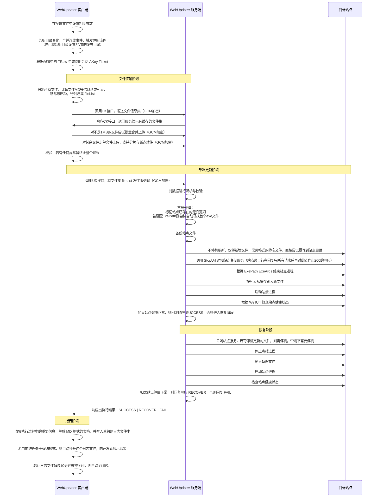

# WebUpdater
## 🧭 功能用途
WebUpdater 是一个专门用于 ASP.NET Core Web 项目在Windows服务器系统上的半自动更新工具，它帮你监听指定目录的文件变化，然后自动将这些文件上传到服务器并完成对相应站点的更新工作，若中间出现任何异常，都将自动尝试回滚操作，它主要用来帮你将 Web 应用部署变得尽量简单、安全、高效。 
 
> - 称其是半自动，是因为编译和发布工作还是要你手动来做，因为这涉及安全与责任，需要一些人为衡量与审核。
> - 本工具只能帮你实现绝大多数场景下的完美自动更新，能帮你完成99%的工作已是它的价值，虽极尽努力，但意外总也无法杜绝，它无法做到极致的完美，你须有这个心理准备。
> - 本工具原则上是专用于 ASP.NET Core Web 项目的自动更新部署，但实际上，只要是文件部署类的程序，皆可不同程度地借用。
> - 最初，我是准备支持传统的 IIS 型项目的部署的，但由于我最新的开发中，几乎都不再使用 IIS 部署了，转而全面使用 .NET5+ 的真机部署，以充分利用 .NET5+ 运行时的性能，加上有了这个自动更新工具，加上Nginx的负载均衡，就可以实现真正的平滑更新了，就更是不再需要IIS了，故而，最终，我暂时放弃了对IIS型项目的直接支持。


## ✨ 功能特性

✔ 自动实时监听指定目录(通常就是发布目录)下文件的新增、修改、删除、重命名事件，并自动防抖(将多个连续事件合并，只响应最后一个)  

✔ 自动增量上传，仅传输新增和变化的文件  

✔ 支持对站点服务的主动停止和健康状态检查

✔ 支持在更新过程出故障时尽最大可能从备份自动恢复

✔ 支持对新增文件和静态文件的不停机更新
  
✔ 支持自研协议授权与安全传输，基于 RSA/AES-GCM/MD5 三种加密方法混合实现。
   
✔ 支持以任意数量的目标服务器和任意数量的站点的批量部署。


## 🧠 为什么需要 WebUpdater？

传统部署一个 Web 项目通常需要经历以下步骤：


如果同时维护多台服务器：  
Server1  
Server2  
Server3  
Server4  
...
 
每一次发布都意味着：
- 手工复制
- 手工停止程序
- 手工备份
- 手工覆盖
- 手工启动
- 手工检查
- 手工恢复

很显然它有以下问题：
- 很繁琐，如上全是手动，多站点时工作量更让人崩溃
- 效率低，一是手速慢，二是不差分出实际变更的全量上传带宽慢
- 忘备份，不出问题还好，一出问题，这就要命了
- 至于上传重复文件浪费带宽和流量的事，都是小事，但它确实是有 
  
WebUpdater 正是为了解决这些实际问题而设计。

 
## 🔥 WebUpdater 能做什么？

WebUpdater 将以上整个传统部署过程全部自动化。当然，正如开篇所说，编译和发布工作仍需要你手动完成，因为这是你作为开发人员应负的审核、决策、担责工作，也交由工具来自动，不是不行，是工具无法做到绝对完美前，这会让权责模糊。

但即便如此，你也只仅需点击一次 Publish 即可完成，它的工作流程大致如下：


看着像是变复杂了，但这一切都是尽可能地自动处理中途遇到的各种故障问题而设计的，且它是自动的，你不需要为此付出太多心神，把这个流程放给你只是让你做到心中有数而已。
 
  

## ⚛️ 系统架构

整个系统由两部分组成：客户端与服务端。


> - 若当前有100个请求已进程站点正在处理中，直接将程序进程干掉，这100个请求的工作进度到了哪里，是否可继续，是否会因断链而出现不可恢复的故障，这是不可断言的，故此，这里设置了一个停止链概念 StopUrl ，但这需要你自已在自已的程序中自行实现它，若你不需要也可省略，此时将直接停止进程。 
> - 程序能够启动，并不代表部署成功，只有健康检查成功，本次部署才算真正完成。但这需要你自行实现一个这样的链接，通常，你只需将站点上的任意一个能正常返回 200 状态码的链接写进去就行了，若你强行不写也行，此时只要启动一次进程，就直接当作成功了，不会检查进程是否存在，因为有些进程就是故意间接再去启动另一个进程，而它自身却是关闭了。
> - 默认会将以下格式的文件当作静态资源文件，直接进行不停机覆写更新：[".js", ".css", ".html", ".htm", ".cshtml", ".xml", ".jpg", ".png", ".gif", ".jpeg", ".txt", ".md", ".pdf", ".xls", ".xlsx", ".doc", ".docx", ".ppt", ".pptx", ".ico", ".mp3", ".mp4", ".zip", ".7z", ".rar", ".woff", ".woff2", ".ttf", ".ttc", ".otf", ".tif", ".tiff", ".jfif", ".apk", ".psd", ".webp", ".rmvb", ".mkv", ".wav", ".sql", ".bat"]

  

## 🚀 使用方法
 
相关的配置项主要有以下几个：   
LogSigns、Urls、SKey、GKey、TRaw、AutoStart、
WebUpdaterClients、SrcDir、IgnorePaths、Dsts、
Server、DstDir、BakDir、StopUrl、WellUrl、ExePath、ExeArgs、UseShell

 
>- 上述各种URL若无特殊说明，统一支持 / 和 \ 分隔，但内部会归一化为 / .
>- ExePath 支持三种书写格式：【"C:\My Tools\demo.exe" --log log.txt --autoall-child】；【C:\MyTools\demo.exe --log log.txt --autoall-child】；【C:\MyTools\demo.exe】
>- UseShell 支持 true false 1 0 yes no 几种写法，内部统一归一化为 1 0 。
>- IgnorePaths 忽略正则，支持 string或string[] 两种形式，如："\d+.txt" 或 ["\d+.txt","\d+.doc"]。
>- LogSigns 日志标识，支持 string|string[]|int[] 三种形式，其中，"+" 号被统一翻译成内部默认值，当前是 [-3, -2, -1, 5, 4, 3]。
>- WebUpdater 的日志标识值是 260517 ，再配合 0-6 中的其中一个，用来输出不同粒度的日志信息。
>- AutoStart 开机自启动，设置为 true 后，会在首次运行时向 Windows 计划任务中注册一个开机自启动的任务，将所在进程 AutoAll.exe 注册为开机自启动。


### 生成TRaw、SKey、GKey 
这三个是一切安全的基石，所以它们是必须配置的项，你可以在启动 AutoAll.exe 后，在其本机调用以下URL，得到一份新的，去配上去，注意端口号，若你没改，则默认如下。

先调用以下链接，可生成一套新的RSA公私钥，取其中的 PKCS#8 私钥配置给你的服务端上的 SKey ，取 PKCS#8 公钥(SPKI) 配置给你的客户端上的 GKey :
http://127.0.0.1:7788/MakeKeys

将上述生成的 SKey 配好后，再调用以下链接，可得到一个 TicketRaw ，简称 TRaw , 把它配置到你的客户端中，这一步实际上就是给客户端授权：
http://127.0.0.1:7788/MakeTicketRaw?sub=1&tokens=WebUpdater&exp=2026-12-31

· 上边的sub表示授权给谁，你可以任意取名，英文字母和数字皆可。
· tokens表示具体授权能用啥功能，AutoAll.exe里还有其他多项功能，WebUpdater只是其中之一，但这里就写它一个就行。
· exp是授权截止时间点，也支持任意ISO往返格式写法，但通常如上简洁书写即可，若你不写，默认10年。


### 最简示例
```json
  //调用 MakeKeys MakeTicket MakeTicketRaw MakeJwt ，以及需HTTP输出StackTrace时，皆需将此置于 true。
  "IsDebug": true,
  //日志标志，特殊值：
  //-1 输出到控制台；-2 输出到文件中；-3 消息前带时间；-4 消息前带日期和时间；+ 表示[-3, -2, -1, 5, 4, 3]；
  //6 None 不记录任何日志 > 5 Critical 严重错误 > 4 Error 错误信息 > 3 Warning 警告信息 > 2 Information 一般信息 > 1 Debug 调试信息 > 0 Trace 最详细 ，(当启用更详细的细粒度级别时，会自动包含启用其上级的更粗粒度级别)；
  //其他日志输出标志，按模块关注点分类，以手动控制只输出某些模块关注点的日志来便于调试。  
  "LogSigns": "+ 0 1 2 3 4 5 260517", //这样就把所有WebUpdater相关的日志输出到最详细级别
  //软件授权证书：可无证书运行7天体验期，若要长期使用，请联系作者获取授权证书。
  "Licence": "AAFm0...",
  //注册开机自启动：0|true表示开机时启动，运行在SYSTEM账户下，无UI界面；1表示在用户登录时启动，运行在具体用户账户下，有UI界面，在账户退出时停止；2表示混合模式，即主进程在SYSTEM下运行，但在每个用户登录时，会启动一个辅助进程，用于实现UI相关能力。 整个功能基于Windows计划任务实现，因此，由于OS版本和PS版本的差异，目前仅完整支持 Win10+|Server2012+&PowerShell5+ ，对于低版本的OS或PS，暂时可以通过手动添加计划任务来实现。
  //"AutoStart": 1,  


  //"AllowedHosts": "*"        //限制HTTP请求的来源主机,确保只接受可信源的请求,若不在名单中，将拒绝该请求并返回 400 Bad Request 响应。默认值:"*",多个时，示例："localhost;127.0.0.1;[::1]"
  //"CertPath": "//https.pfx", //SSL证书文件路径
  //"CertPass": "1",           //SSL证书文件密码
  "Urls": "http://*:7788",     //HTTP监听地址，多个时，示例："http://*:7788;https://*:8877;http://127.0.0.1:7788;" 。凡需要HTTP服务端的功能皆须配置此项，否则不启动HTTP服务端，WebUpdater客户端也无法使用。
  "SKey": "MIIEvQIBADA....",   //服务端才需要配这个，它是RSA私钥，千万别配错，否则RSA私钥泄露。
  "GKey": "GDV62QIDAQAB...",   //客户端才需要配这个，它是RSA公钥。
  "TRaw": "AAFm0pv9bv9b...",   //客户端才需要配这个，它是由服务端颁发给此客户端独享的授权证书。
   
  //支持任意多个WebUpdater客户端，也就是可以监听任意多个本地目录，它们之间的虽监听是并行的，但最终在更新时，还是会串行，无它，只是让日志输出更好看些。
  //· 允许将 StopUrl WellUrl ExePath ExeArgs UseShell 这几个值直接在客户端节点根上统一配置，以让诸目标上可以直接继承他们，以减省些书写。
  //· 允许用 .符 来设置ExePath，以表示让本程序自行搜寻目标站点目录中的首个exe文件作为启动路径(可执行文件路径).
  "WebUpdaterClients": [
    {
      "SrcDir": "C:/MySVN/WebCenter/bin/Publish/net8", //要监听的本地目录，若无此项，则忽略此客户端
      "IgnorePaths": [ "^.+\\.(txt|cs)$", "^.+?(?:~\\w+?\\.TMP|\\.\\w+?~)$" ], //忽略路径集，以正则表示，以相对路径作为匹配源(分割符统一用/，且左右皆无/符)
      "Guard": "00:01:00", //守护检查频率，它以循环触发更新事件的方案来实现，其值表达的是在触发了一次更新事件后，再间隔多长时间尝试触发下一次，支持所有C#-TimeSpan所支持的字符串格式，主要是 days.HH:mm:ss.fffffff，但最常用的仍是 HH:mm:ss，即时分秒。不配置时默认不守护，它可在配置变更后30秒左右自动发现变更并开始或结束守护。
      "AutoWindow": true,  //true表示自动显示和隐藏窗口，主要是在客户端发起更新时，把窗口显示出来，以便用户看到更新的进度和结果，更新完成后再自动隐藏窗口。不配置时，默认false.
      //模式开关：(多种开关可自由按需配置，以|符分隔，默认配置只是开发者认为的最佳方案)
      //· 1表示使用管理员权限启动(默认LocalService)；(暂未实现)
      //· 2表示使用Shell启动(默认不使)。在服务端有UI界面黑窗口时，若不用Shell启动，则新启动的程序将与服务端共用同一个控制台黑窗口。它将在后续版本中替代UseShell这个配置项，用以将来扩展出更多控制开关。(暂未实现)
      //· 3表示自动显示和隐藏窗口，主要是在客户端发起更新时，把窗口显示出来，以便用户看到更新的进度和结果，更新完成后再自动隐藏窗口。(默认恒隐藏)；它将在后续版本中替代 AutoWindow 这个配置项。(暂二者并行支持)
      //· 4表示对每个监听目录串行执行上传过程(默认并行)；
      //· 5表示对每个监听目录并行执行更新过程(默认串行)；  
      "Mode":"4|5"         
      "Dsts": [    //要更新的目标终节点，每个终结点以[Server+DstDir]作为默认Id标识(你也可以手动显式指定Id标识)，若无此二者中的任意一个则忽略此终节点
        {            
          "Server": "http://127.0.0.1:7788", //远端机器上的助手服务基地址
          "DstDir": "D:/Temp/Test/Web",      //远端机器上的目标站点目录 
          "BakDir": "D:/Temp/Test/Bak",      //远端机器上的备份目录，更新前会先把目标站点目录的内容备份到这里，以便在更新失败时可以回滚恢复
          "StopUrl": "http://127.0.0.1:8002/Home/Stop", //远端机器上的站点服务停止接口，更新前调用此链以通知站点停止服务，返回 200 响应时表示已成功停止。
          "WellUrl": "http://127.0.0.1:8002/Home/Test", //远端机器上的站点健康检查接口，更新并启动后调用此链以检查站点是否存在故障，返回200响应表示无故障，另，在守护检查时，也会用到此链来检查站点服务是否正常。
          "ExePath": "WebCenter.exe",        //远端机器上的站点启动程序路径(相对路径和绝对路径皆可)，若不提供，且目录内exe文件唯一，则会自动识别，否则将不启动站点。
          "ExeArgs": "--Port 8002",          //远端机器上的站点启动程序参数
          "UseShell": true                   //true表示使用Shell方式启动，false表示直接启动。实际上通常是指是否使用UI界面，大多数程序跑在0层会话，故此通常可不设，即 false，这里只是告诉你我支持它。另，在服务端有UI界面黑窗口时，若不用Shell启动，则新启动的程序将与服务端共用同一个控制台黑窗口。
        }  
      ]
    }
  ], 
```


### 注意事项

#### ➤ 热修改与热更新：
- 配置文件可以在运行时直接编辑和修改，这个过程可称为热修改与热更新。
- 每次修改后保存时，会触发配置节点扫描，所有节点都将被重建一个新的并放入客户端组件实例总集，在放入前会先软通知旧组件终结掉，但始终会有一小段时间，新旧组件同时存在，内部会对这些组件的实际工作进行串行化，故它们可能存在极小概率的顺序先后问题，但不会并行打架。
- 热更新前后或正在运行中的有哪些客户端组件实例，可以通过以下手段输出并查看：在配置中打开 IsDebug:true ，并将日志标识LogSigns中写入[0 260517]，意为关注WebUpdater相关日志，并要查看最详细级别的日志，此时，就会在日志文件或控制台中查看相关输出了，但是要注意，由于开发者的懒省事操作，这个行为并不是单独的线程循环来做，而是借助了组件的自修复线程循环来实现，故此，当有N多客户端节点时，它会重复性输出N多遍，看着不爽，但不影响大局，毕竟好人谁天天看这个啊...。


